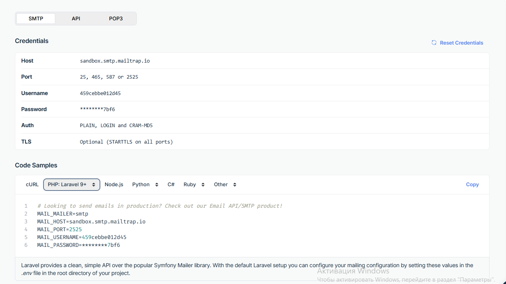

# 🩺 Diabetes Management System

## Author: Vladyslav Liulka

## 📖 Project Overview
This project is designed to assist in diabetes treatment by providing a seamless platform for **Doctors** and **Patients** to collaborate and manage health data effectively.

## ✨ Key Features

### 🔐 User Management
- ✅ **Registration** with mandatory email verification via **Mailtrap**
- 🔑 **Authentication**, 🔄 **Password Recovery**, and 📝 **"Remember Me"** functionality
- 🖊️ Editable **User Profiles** for both **Doctors** and **Patients**

### 👨‍⚕️ Doctor Functionality
- 🗂️ Manage and monitor **assigned patients**
- 📋 **Create**, 🔍 **View**, and ✏️ **Edit** personalized **Treatment Plans**
- 📊 Access and review **Patient Health Data**

### 🧑‍🦱 Patient Functionality
- 📈 Full **CRUD** operations for **Glucose Measurements**
- 🏥 View assigned **Treatment Plans** from doctors

# Project Setup Guide

## Project Description
This project is a Laravel-based web application running inside Docker containers. The environment includes PHP 8.2, MySQL 8.0, and Nginx.

## Prerequisites
Before setting up the project, ensure the following software is installed on your system:

1. **Docker** - [Install Docker](https://docs.docker.com/get-docker/)
2. **Docker Compose** - [Install Docker Compose](https://docs.docker.com/compose/install/)
3. **Git** - [Install Git](https://git-scm.com/book/en/v2/Getting-Started-Installing-Git)

## Installation Steps

### 1. Clone the Repository
```bash
git clone <repository-url>
cd <repository-folder>
```

### 2. Start Docker Containers
Run the following command to build and start the Docker containers:
```bash
docker-compose up -d --build
```

### 3. Make migrations
```bash
docker exec -it laravel_app php artisan migrate
```

### 4. If there is a write permission error, execute:
```bash
docker exec -it sudo chmod -R 775 src/storage src/bootstrap/cache
```

### 5. Access the Application
- Open your browser and navigate to [http://localhost:8080](http://localhost:8080) to access the application.

### 6. Configure mailtrap to test email verification
You have to register in mailtarp (a few clicks using github). 
After registration chose `Email Testing` -> `chose your inbox`.
There you can se your credentials, put them into .env file.
. You can chose Code Samples Laravel 9+ and copy that 
code into .env file `INSTEAD` of the config that's in there now.

### 6. Manage Containers (can be done from Docker desktop)
To stop the containers:
```bash
docker-compose down
```

To rebuild the containers:
```bash
docker-compose up --build
```

## Project Structure

- **.git/** - Git version control folder
- **.idea/** - Project configuration files for IDE
- **nginx/** - Nginx configuration files
  - `default.conf` - Nginx server configuration
- **src/** - Application source code
- **docker-compose.yml** - Docker Compose configuration file
- **Dockerfile** - Dockerfile for building the PHP environment

## Docker Configuration Overview

### Docker Compose (`docker-compose.yml`)
- **Services:**
  - **app:** PHP 8.2 with Laravel
  - **db:** MySQL 8.0 database
  - **nginx:** Web server to serve the application

### Dockerfile
- Installs PHP dependencies and Composer
- Sets the working directory to `/var/www/html`

### Nginx Configuration (`nginx/default.conf`)
- Listens on port 80
- Routes requests to PHP-FPM through the `app` container

## Useful Commands

- Check running containers:
```bash
docker ps
```

- View logs:
```bash
docker-compose logs
```

- Enter the app container:
```bash
docker exec -it laravel_app bash
```

## Troubleshooting
- If you encounter permission issues, try running Docker commands with `sudo` or adjust Docker permissions.
- Ensure no other services are using ports 8000, 8080, or 3306.

---

